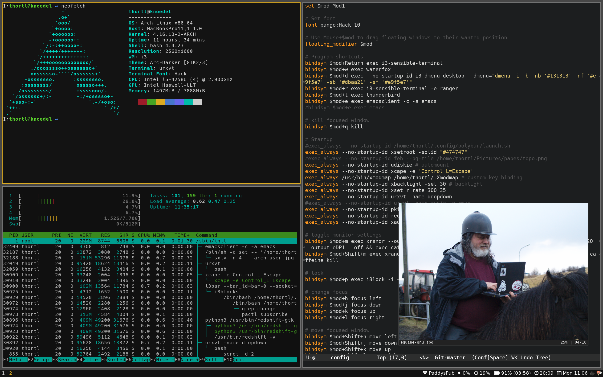

# Thortl's GNU/Linux dotfiles

Directory containing all the dotfiles used on my current Arch Linux system; feel free to help yourself.

## How to

- Make sure GNU Stow is installed
- `git clone https://gitlab.com/thortl/dotfiles`
- Use `stow <dir>` for each program required.
